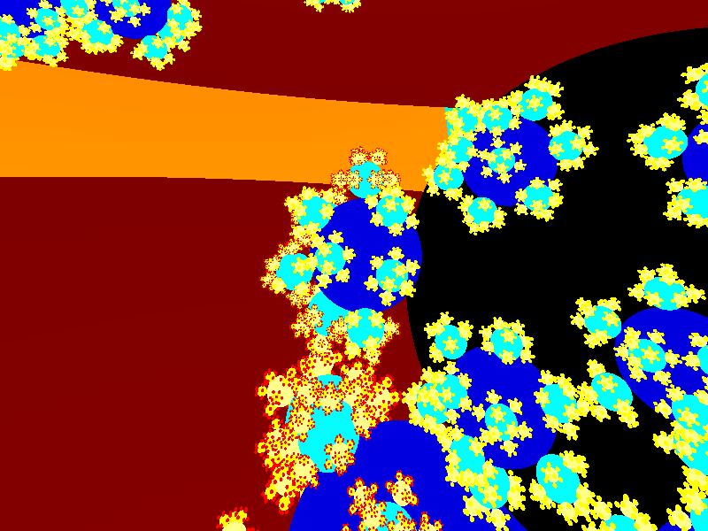
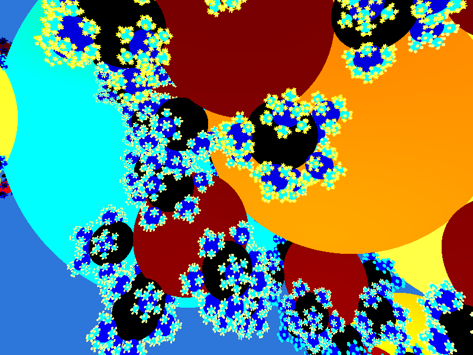
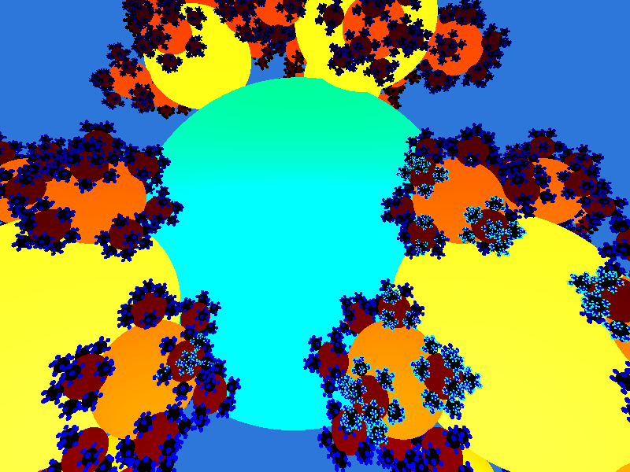
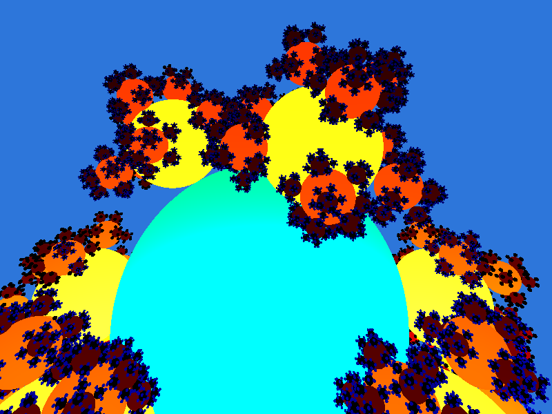
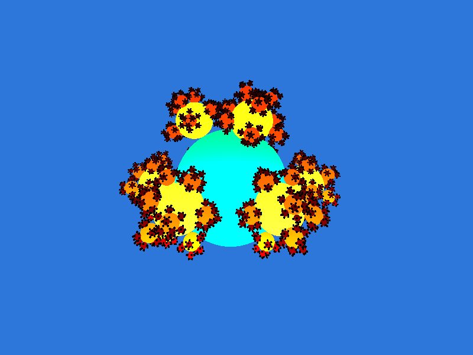

# Sphereflake
This is ray tracing implementation of the Sphereflake fractal as described by Eric Haines here: http://www.realtimerendering.com/resources/SPD/
The implementation uses threads and SIMD. No shading is done.

Libraries used: SDL2 (for window creation and events) and glew (for opengl).
Both were obtained via vcpkg.
Official sources:

SDL https://www.libsdl.org/download-2.0.php

GLEW http://glew.sourceforge.net/

Screens:

 
 
 
 
 
